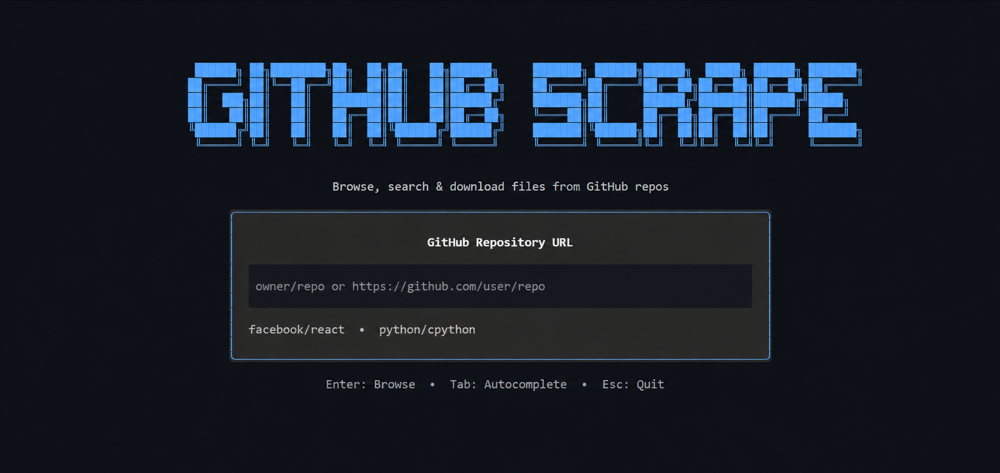

<div align="center">

# Github Scrape

[](https://pypi.org/project/github-scrape/)
[](https://pypi.org/project/github-scrape/)
[](https://github.com/Vamsiindugu/Github-Scrape/actions)
[](LICENSE)

**⚡ Browse, search & download files from GitHub repos without cloning**

*A fast, beautiful TUI for cherry-picking exactly what you need from any repository*

</div>



---

## 📚 Table of Contents

- [📌 Overview](#-overview)
- [✨ Features](#-features)
- [🏗️ Architecture](#️-architecture)
- [🚀 Installation](#-installation)
- [📖 Usage](#-usage)
- [⌨️ Keyboard Shortcuts](#️-keyboard-shortcuts)
- [⚙️ Configuration](#️-configuration)
- [🤝 Contributing](#-contributing)
- [📄 License](#-license)

---

## 📌 Overview

**Github Scrape** is a *terminal-based file browser* that lets you:

- Browse **any public or private** GitHub repository interactively
- **Fuzzy search** through thousands of files instantly
- **Download only what you need** — no more `git clone` + `rm -rf`
- Navigate with a **beautiful TUI** powered by [Textual](https://github.com/Textualize/textual)

> 💡 *Built with Python 3.12+, powered by `asyncio` and designed for speed*

* * *

## ✨ Features

| Feature | Description |
|---------|-------------|
| 🔍 **Fuzzy Search** | Find files instantly with `rapidfuzz` matching |
| 📊 **File Preview** | View file contents before downloading |
| 📦 **Batch Download** | Select multiple files & folders, download in parallel |
| 🔐 **Private Repo Support** | Works with your GitHub token |
| 💾 **LFS Detection** | Warns about Git LFS files |
| 🎨 **Dual Themes** | Toggle between emoji 📁 and ASCII `[D]` icons |
| 📂 **Smart Paths** | Creates directories matching repository structure |
| ⚡ **Async I/O** | Concurrent downloads with semaphore control |

* * *

## 🏗️ Architecture

```
github-scrape/
├── src/github_scrape/
│   ├── __init__.py      # Package entry point
│   ├── api.py           # GitHub API client (httpx + asyncio)
│   ├── cli.py           # Typer CLI interface
│   ├── config.py        # User settings (TOML)
│   ├── downloader.py    # Async file downloads
│   ├── tui.py           # Textual TUI screens
│   └── utils.py         # URL parsing & sanitization
├── tests/               # 110+ tests (pytest)
└── .github/workflows/   # CI/CD pipeline
```

**Tech Stack:**

| Component | Technology |
|-----------|------------|
| CLI | `typer` with Rich formatting |
| TUI | `textual` reactive framework |
| HTTP | `httpx` async client |
| Testing | `pytest` + `respx` + `pytest-asyncio` |

* * *

## 🚀 Installation

### Prerequisites

- Python **3.12 or higher**
- pip or pipx

### Quick Install

```bash
# Using pipx (recommended)
pipx install github-scrape

# Using pip
pip install github-scrape
```

### Development Setup

1️⃣ Clone repository
```bash
git clone https://github.com/Vamsiindugu/Github-Scrape.git
cd Github-Scrape
```

2️⃣ Create virtual environment
```bash
python -m venv .venv
source .venv/bin/activate  # Windows: .venv\Scripts\activate
```

3️⃣ Install in editable mode
```bash
pip install -e ".[dev]"
```

4️⃣ Run tests
```bash
pytest tests/ -v
```

* * *

## 📖 Usage

### 🎬 Interactive Mode

Launch the TUI with no arguments:

```bash
github-scrape
```

**Then:**
1️⃣ Enter a URL or shorthand (`owner/repo`)
2️⃣ Press `Tab` to auto-fill `https://github.com/`
3️⃣ Browse with arrow keys, toggle selection with `Space`
4️⃣ Press `d` to download

### ⚡ Direct Mode

```bash
# Browse specific repo
github-scrape https://github.com/python/cpython

# Use shorthand
github-scrape python/cpython

# With options
github-scrape python/cpython --token YOUR_TOKEN --cwd --no-folder
```

### 🔧 Command Reference

| Command | Description |
|---------|-------------|
| `github-scrape` | Launch interactive TUI |
| `github-scrape <url>` | Browse specific repository |
| `github-scrape config set token <TOKEN>` | Save GitHub token |
| `github-scrape config set path <PATH>` | Set download directory |
| `github-scrape config list` | Show current settings |
| `github-scrape config unset token` | Remove saved token |

* * *

## ⌨️ Keyboard Shortcuts

### Navigation

| Key | Action |
|-----|--------|
| `↑/↓` or `j/k` | Move cursor up/down |
| `Enter` or `l` | Open folder / file |
| `h` or `Backspace` | Go to parent folder |
| `g` / `Home` | Jump to first item |
| `G` / `End` | Jump to last item |

### Selection

| Key | Action |
|-----|--------|
| `Space` | Toggle file selection |
| `a` | Select all visible files |
| `u` | Unselect all |

### Search

| Key | Action |
|-----|--------|
| `/` | Focus search bar |
| `Escape` | Clear search / exit search |
| `Ctrl+U` | Clear search input |

### Actions

| Key | Action |
|-----|--------|
| `d` | Download selected files |
| `i` | Toggle emoji ↔ ASCII icons |
| `o` | Open download folder |
| `q` | Quit |
| `Ctrl+C` | Force quit |

* * *

## ⚙️ Configuration

### Config File Location

| OS | Path |
|----|------|
| Linux/macOS | `~/.config/github-scrape/config.toml` |
| Windows | `%APPDATA%\github-scrape\config.toml` |

### Available Settings

```toml
[github]
token = "ghp_xxxxxxxxxxxxxxxxxxxx"

[download]
default_path = "/home/user/Downloads/github-scrape"
```

### Getting a GitHub Token

1️⃣ Go to **Settings → Developer settings → Personal access tokens**
2️⃣ Generate a new token with `repo` scope
3️⃣ Save it: `github-scrape config set token YOUR_TOKEN`

* * *

## 🤝 Contributing

Contributions are welcome! Please follow these steps:

1️⃣ **Fork** the repository
2️⃣ **Clone** your fork: `git clone https://github.com/YOUR_USERNAME/Github-Scrape.git`
3️⃣ **Create** a feature branch: `git checkout -b feature/amazing-feature`
4️⃣ **Make** your changes
5️⃣ **Run** quality checks:
```bash
# Linting
ruff check src/github_scrape tests/

# Type checking
mypy src/github_scrape

# Tests
pytest tests/ -v
```
6️⃣ **Commit** with clear messages: `git commit -m "feat: add amazing feature"`
7️⃣ **Push** to your fork: `git push origin feature/amazing-feature`
8️⃣ **Open** a Pull Request

### Development Guidelines

| Quality Gate | Command | Required |
|--------------|---------|----------|
| Linting | `ruff check .` | ✅ |
| Type checking | `mypy src/github_scrape` | ✅ |
| Tests | `pytest tests/` | ✅ |
| Coverage | >80% | ✅ |

* * *

## 📊 Testing

```bash
# Run all tests
pytest tests/ -v

# Run with coverage
pytest tests/ --cov=github_scrape --cov-report=html

# Run specific test file
pytest tests/test_tui.py -v
```

**Current Coverage:** 110+ tests passing, 8 TUI integration tests skipped.

* * *

## 🙏 Acknowledgments

- **[Textual](https://github.com/Textualize/textual)** — The incredible TUI framework
- **[Typer](https://github.com/tiangolo/typer)** — Beautiful CLI interfaces
- **[Rich](https://github.com/Textualize/rich)** — Terminal formatting
- **[ghgrab](https://github.com/abhixdd/ghgrab)** — Original inspiration

* * *

## 📄 License

Distributed under the **MIT License**. See [LICENSE](LICENSE) for details.

---

<div align="center">

**Crafted with 💙 by [Vamsi Indugu](https://github.com/Vamsiindugu)**

</div>
